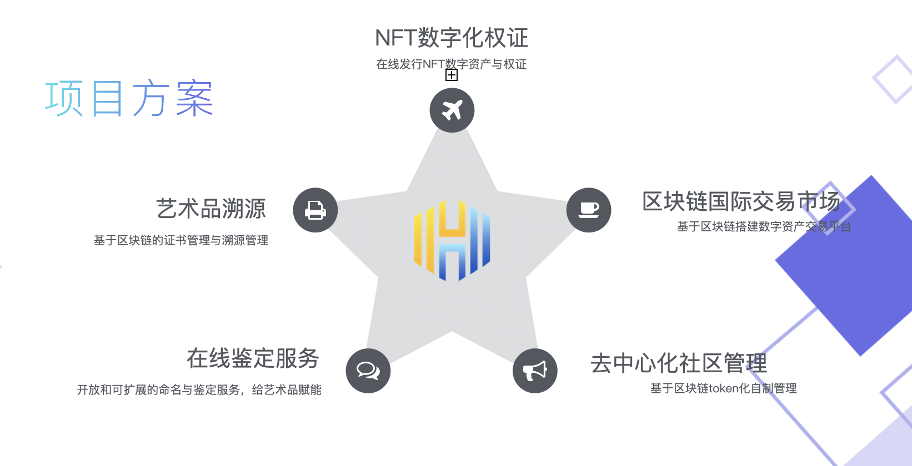
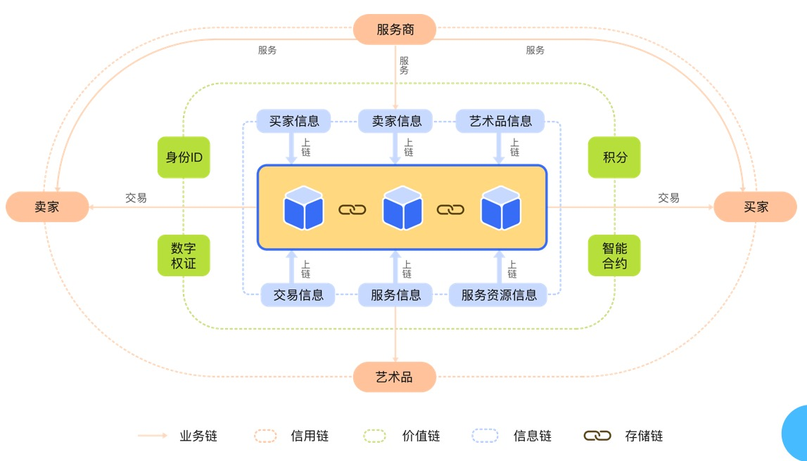

### 项目介绍

- 云画链网络是基于Substrate区块链技术开发的去中心化区块链链与跨链桥网络，专注于建设未来文化艺术品NFT资产互联网络。云画链以动漫（二次元）用户人群为切入口，计划在数字文化资产拍卖市场，数字艺术品兑换等领域进行业务拓展。目前正在研发高性能NFT资产跨链中继服务 Chain Relay，异构链跨链转接桥，非标资产跨链标准，跨链兑换协议，兼容EVM的虚拟机等等。

### 项目类别

NFT / 游戏链

### 项目要解决的问题
- 传统艺术品鉴定溯源为中心化权力机构，会出现创作者本人对作品真实性判断与鉴定机构结果出现矛盾的情况，使用去中心化技术的云画链可彻底杜绝此类现象。  
- 时代与技术背景的发展使得艺术的创作、欣赏、与保留（展示）方式发生了变化，云画链为独一无二的数字艺术品创作、发行、交易、流转提供了新的区块链平台。  

### 项目解决方案/架构

### 应用场景
- 链上NFT资产拍卖所：DAH，decentralized auction house. 是云画链生态的核心，提供NFT艺术品上链，鉴赏，拍卖等功能，初期由专门团队运营，成熟后由社区投票决定各项细则。
- NFT艺术创作者：艺术家，直接创作加密艺术品crypto art或将实体艺术品权证登记上链。
- NFT鉴赏者：观赏与收藏NFT数字艺术的用户，潜在买家。
- NFT买家投资人：在DAH上购买艺术品的用户。
- NFT签名机构：提供收藏建议以及认证。

### Project introduction

- UniArts chain network is a decentralized network and bridge network based on Substrate blockchain technology. It focuses on the establishment of NFT art assets network. UniArts chain takes Anime (Two dimensions) users as the entry point. The planning is to expand the business in the fields of digital cultural assets auction and digital art exchange. And dozens of high-performance NFT asset cross chain service are under development. "Chain Relay" "Heterogeneous chain cross bridge" "Cross chain assets standard" "Cross chain exchange agreement" "EVM compatible virtual machine" etc.

### Project category

NFT / Game Chain

### Problem to be solved
- The traditional art origin tracing appraisal comes from the central authority. Contradictions are inevitable between the creator's judgment and the results of the central authority. UniArts chain using decentralized technology will completely eliminate this problem.
- With the development of times and technology, the way of art creation, appreciation and preservation (display) is changing. In order to adapt to this change, UniArts chain provides a unique blockchain platform for the digital art creation, distribution, transaction and circulation.

### Project solution

- NFT digital copyright certification: Online distribution of NFT digital assets and copyright certification
- The Art origin tracing: Certificate management based on blockchain and traceability management
- Online identification service: Open and extensible naming and identification services, enabling works of Art。
- Blockchain international trading market: Building digital asset trading platform based on blockchain
- Decentralized community management: Autonomous management based on blockchain token

### Applications
- NFT asset auction house on chain: DAH，decentralized auction house. (the core of UniArs chain ecology). Provide NFT art distribution, appreciation, auction and other functions
- NFT art Creator: artist, create crypto art directly or register entity art on the chain
- NFT appreciator: Users of viewing and collecting NFT Digital Art. (potential buyers)
- NFT buyer Investor: users who buy art on DAH
- NFT signature agency: provide collection suggestions and certification
